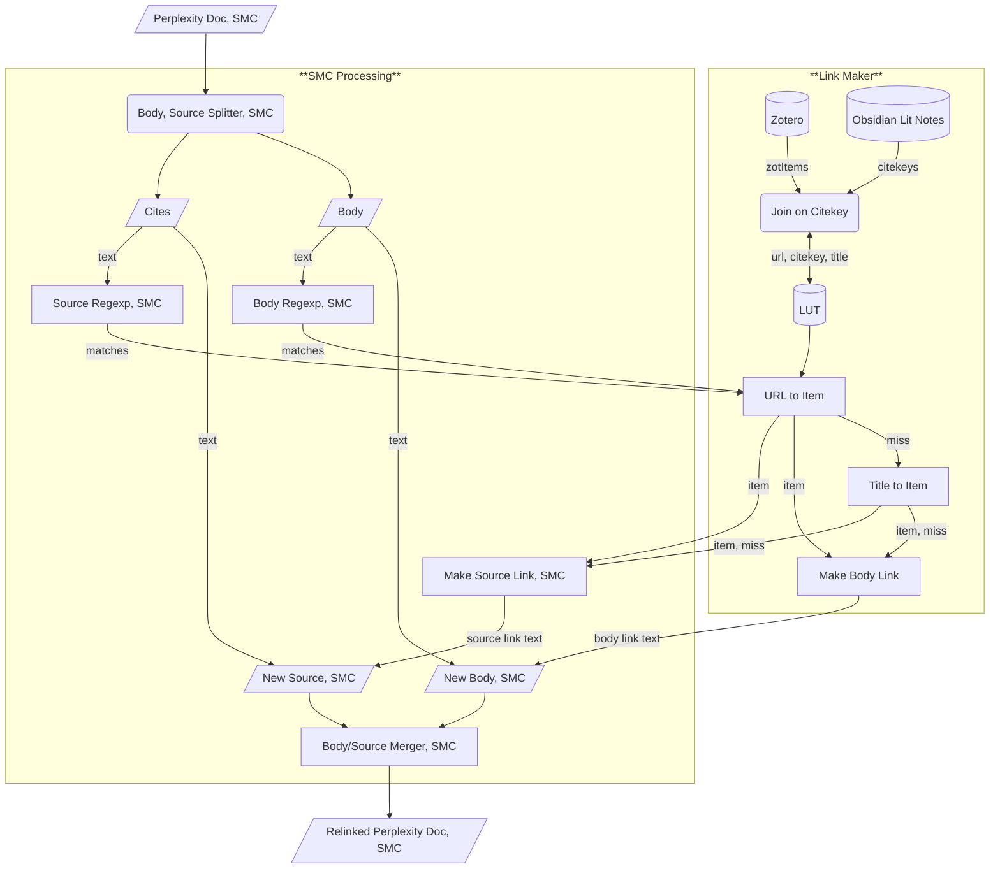

# Header
- bullet 1
- bullet 2

**And this is a drawing**

```mermaid
graph TD;
    Perplexity[/Perplexity Doc, SMC/] --> Splitter(Body, Source Splitter, SMC)
    Splitter -->Body[/Body/]--text--> NewBdy[/New Body, SMC/];
    Splitter -->Cites[/Cites/]--text--> NewSrc[/New Source, SMC/];

    subgraph Lookup["**Link Maker**"]
        Zotero[(Zotero)] -- zotItems --> Join(Join on Citekey);
        Obsidian[(Obsidian Lit Notes)] -- citekeys --> Join;
        Join <-- url, citekey, title --> LUT[(LUT)];
        LUT --> URLmatch[URL to Item];
        URLmatch -- miss --> TitleMatch[Title to Item];
        URLmatch -- item --> MkBodyLink[Make Body Link];
        TitleMatch -- item, miss --> MkBodyLink;
    end

    TitleMatch -- item, miss --> MkSourceLink[Make Source Link, SMC];
    URLmatch -- item --> MkSourceLink;

    Body --text--> BodyRexp[Body Regexp, SMC] --matches-->URLmatch;
    Cites --text--> SourceRexp[Source Regexp, SMC] --matches-->URLmatch;

    MkBodyLink -- body link text --> NewBdy;
    MkSourceLink -- source link text --> NewSrc;
    NewBdy --> Merger[Body/Source Merger, SMC] --> NewDoc[/Relinked Perplexity Doc, SMC/];
    NewSrc --> Merger

    subgraph SMC["**SMC Processing**"]
    Body
    BodyRexp
    Cites
    SourceRexp
    Splitter
    Merger
    NewBdy
    NewSrc
    MkSourceLink
    end
```
