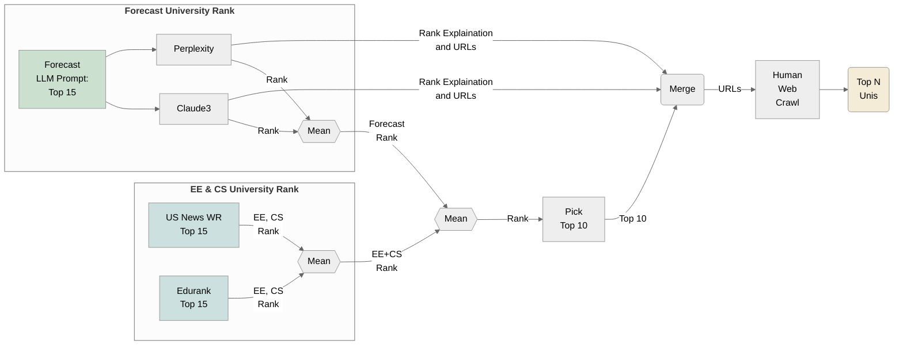
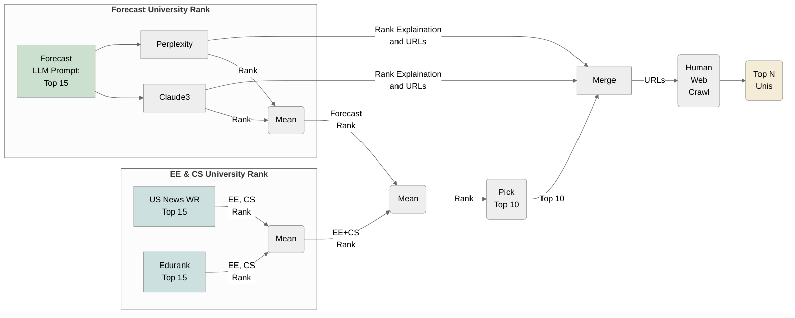
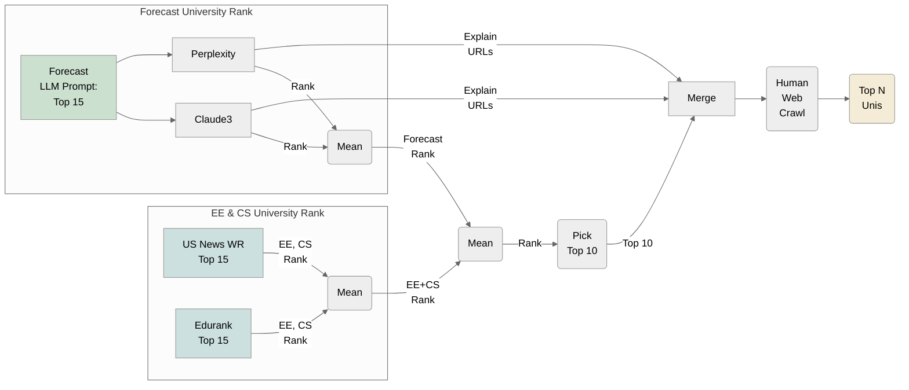

- Graph generated for 5/3/2024 presentation
- Online Mermaid editor link: [Forecast Uni Pick V2](https://www.mermaidchart.com/app/projects/08a93b4d-c08f-43f0-9cff-013f940ff53a/diagrams/736c47c0-1248-4ebe-9cdc-57359c971dd7/version/v0.1/edit)

**Mermaid code V2**: cursor into render to see code.  
*This looks worse in obsidian* than screenshot I made online, before I signed up for an online mermaid account.  This one obscures boxes, and overwrites the EE, CS University subgraph title.  The online one is also kinda worse, no longer has a white background, but one in pale blue, which I think will look dumb in slides.  Maybe that can be fixed?  Also, in obsidian, I'd rather view the code in one window, and the rendering in another, rather than have the rendering hide the code, as here.

# Mermaid of V2 w/ octagonal means (a little messed up)

# Mermaid V2

**Mermaid code V1**

-

